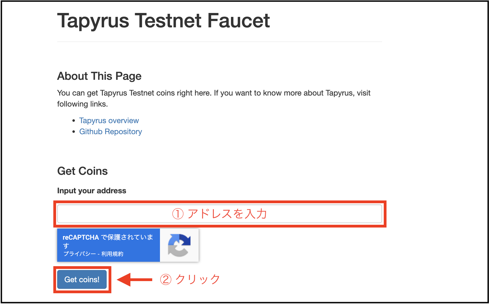
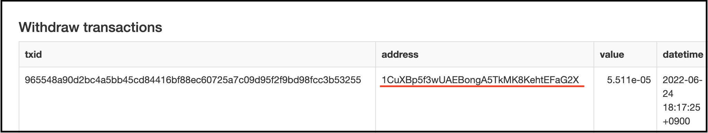

本記事ではChaintopeが提供するTapyrusのテストネット（networkid 1939510133）上でTapyrusの通貨であるTPCを送受金する方法について解説します。　　
Chaintopeが運営する[Tapyrus Testnet Faucet](https://testnet-faucet.tapyrus.dev.chaintope.com/tapyrus/transactions){:target="_blank"}からTPCを受け取り、tapyrus-coreのCLIを用いてWalletを操作し、送金やトランザクション・ブロックの詳細を確認します。　　

本記事ではTapyrusノードの環境構築方法については解説しません。  
環境構築方法については、以下の記事を参照してください。  
 - [Tapyrus Coreノード構築方法（macOS版）](https://site.tapyrus.chaintope.com/setup/osx)
 - [Tapyrus Coreノード構築方法（Ubuntu版）](https://site.tapyrus.chaintope.com/setup/ubuntu)
 - [Tapyrus Coreノード構築方法（Docker版）](https://site.tapyrus.chaintope.com/setup/docker)


## tapyrus-cliについて

tapyrus-cli以下のような構成で入力を行います。
```
$ tapyrus-cli [options] <command> [params] 
```
- option: コマンドを実行する際に指定する任意の設定。RPC操作を行なうユーザー名・パスワードやWalletの名前など。
- command: 実行したい操作の命令。
- params: コマンドを実行する際に指定する任意の引数。

tapyrus-cliコマンドの詳細は以下は`tapyrus-cli -h`で確認できます。

### 注意事項

実行環境によって入力するコマンドに違いがある場合があります。

##### tapyrus-cliコマンド実行時のパスについて
`make install`を実行していない場合、`tapyrus-cli`コマンドの実行時にパスを指定して実行する必要があります。
```
$ <cloneしたディレクトリ>/tapyrus-core/src/tapyrus-cli <command> [params]
```

##### Dockerを使用する場合
Dockerを使用する場合、全てのコマンド実行時にオプションに`-conf=/etc/tapyrus/tapyrus.conf`を指定する必要があります。  
(実行例)  
```
$  tapyrus-cli -conf=/etc/tapyrus/tapyrus.conf createwallet "wallet1" 
```

## Wallet, Addressの作成

TPCを受け取るWalletの作成を行います。  
Walletの作成には`tapyrus-cli`の`createwallet`コマンドを用います。  
Walletには任意の名前をつけることができ、`createwallet`の後に引数として指定します。  
以下のコマンドでは`wallet1`という名前のWalletを作成しています。  
```
$ tapyrus-cli createwallet "wallet1"
{
  "name": "wallet1",
  "warning": ""
}
```

Walletの初期状態の確認を行います。  
`getbalance`コマンドを用いて、所有するTPCの量を確認します。  
実行時、`-rpcwallet`オプションで使用するWalletを指定します。  
`0.00000000`と表示され、TPCを所有していないことが分かります。  
```
$ tapyrus-cli -rpcwallet=wallet1 getbalance
0.00000000
```

さらに`listunspent`コマンドを用いて、UTXOを確認します。  
これも初期状態のため、空であることが確認できます。  
```
$ tapyrus-cli -rpcwallet=wallet1 listunspent
[
]
```

`getnewaddress`コマンドを用いてアドレスを生成します。  
実行すると表示される文字列がWalletのアドレスです。  
このアドレスはfaucetからのコイン受取時に使用するため控えておいてください。  
```
$ tapyrus-cli -rpcwallet=wallet1 getnewaddress
1CuXBp5f3wUAEBongA5TkMK8KehtEFaG2X
```


## faucetからのTPC取得


[Tapyrus Testnet Faucet](https://testnet-faucet.tapyrus.dev.chaintope.com/tapyrus/transactions){:target="_blank"}からTPCを受け取ります。  

`Input your address`と表示された入力欄に先程生成したアドレスを入力し、「Get coins!」ボタンをクリックします。  



「Withdraw transactions」のリストに自分のアドレス宛のトランザクション情報が表示されるとTPC取得は成功です。  


TPC取得が確定されるためには、トランザクションがSignerノードに承認され、ブロックに取り込まれるのを待つ必要があります。  
Tapyrusではブロックの生成間隔はSignerノードで設定を行います。  
Chaintopeが提供するTapyrusのテストネット（networkid 1939510133）ではブロック生成間隔が10分に設定されているため、faucetからの送金トランザクションが承認されるまでしばらく待ちます。  

#### 注意
Faucetに表示された`Current Balance`が0の時、TPCを取得することができません。  
その際は、補充されるのをお待ちください。  

## 取得したTPCの確認

`getbalance`コマンドを用いて、再度所有するTPCの量を確認します。  
今回は`0.00005506`TPCを所有していることが確認できます。　　
```
$ tapyrus-cli -rpcwallet=wallet1 getbalance
0.00005506
```

同様に`listunspent`コマンドを用いて、UTXOを確認します。  
faucetから受け取ったTPCがUTXOとして表示されます。
```
$ tapyrus-cli -rpcwallet=wallet1 listunspent
[
  {
    "txid": "8631dbf501ebfbfea02908c2ec8e33b52f61adac3e9ca88ba4fe7aed845e084a",
    "vout": 0,
    "address": "16xEUxgJt7PNZpuXB8w5y7XUzdLnGwZPnP",
    "token": "TPC",
    "amount": 0.00005506,
    "label": "",
    "scriptPubKey": "76a914414ac2d636c7f55d2dcbbc9e568675450d222e0f88ac",
    "confirmations": 1,
    "spendable": true,
    "solvable": true,
    "safe": true
  }
]
```

## 送金

次にTPCの送金方法について解説します。  
本記事では同じwalletで別のアドレスを生成し、自分自身に対して送金を行ないます。   


再度`getnewaddress`を実行し、新しいアドレスを生成します。
```
$ tapyrus-cli -rpcwallet=wallet1 getnewaddress
1Ky1XpDQ1NUQ5fvssZpAfmdR1nv8mz4nu4
```

送金には`sendtoaddress`コマンドを用います。  
`sendtoaddress`コマンドは"送金先アドレス"、"送金するTPC額"を引数として指定します。  
以下のコマンドのように`sendtoaddress`に続けて新しいアドレスと` 0.00001`TPCを指定し実行します。  
```
$ tapyrus-cli -rpcwallet=wallet1 sendtoaddress <新しいアドレス> 0.00001
```  

(実行例)
```
$ tapyrus-cli  -rpcwallet=wallet1 sendtoaddress 1Ky1XpDQ1NUQ5fvssZpAfmdR1nv8mz4nu4 0.00001
dae37f4deada8f75a8aa3ab3ec262a26682152b6ec2f83972fd83b93768427de
```

実行するとハッシュ値が表示されます。
これは送金トランザクションのtransaction idです。後ほど詳細確認に使用するため控えておいてください。  


以上で送金は完了です。

## 送金トランザクション・ブロックの詳細確認

ここからはトランザクションやブロックの詳細情報を確認する方法を解説します。

トランザクションの生データを確認するためには`getrawtransaction`コマンドを用います。  
`getrawtransaction`の引数には先程控えておいたtransaction idを指定します。
```
$ tapyrus-cli -rpcwallet=wallet1 getrawtransaction <transaction id>
```

実行すると以下のように、トランザクションのhex値を取得することができます。
```
01000000014a085e84ed7afea48ba89c3eacad612fb5338eecc20829a0fefbeb01f5db3186000000006a47304402200d0b007d0b8bd98bee2b6a83c3eed8b4878504d82f41c29bdde920c64f06ee0202200ea47cc0962f669a6c584d6c2f3d3dd16bc72ce6afaa0cc5e80175a20ba8a246012102d1242435f408c12dc15cfcb6b47cf9a2cdffb6daa39aa282192f9746755a192bfeffffff01e8030000000000001976a914d00a005f614520d52cec8fce25029ef52c46e73888ac71350300
```


トランザクションの詳細情報確認には`gettransaction`コマンドを実行します。  
同様にtransaction idを引数に指定します。
```
$ tapyrus-cli -rpcwallet=wallet1 gettransaction <transaction id>
```

実行すると以下のように、JSON形式のトランザクション情報が確認できます。  
`blockhash`項目に表示されているハッシュ値をコピーします。  
（以下の例では`175b461c789561a7aa48d27b5a6b8552020c1eb6ec8a271e6a2fb4b76d132d54`）
```javascript
{
  "token": "TPC",
  "amount": 0.00000000,
  "fee": -0.00004506,
  "confirmations": 1,
  "blockhash": "175b461c789561a7aa48d27b5a6b8552020c1eb6ec8a271e6a2fb4b76d132d54",
  "blockindex": 1,
  "blocktime": 1656406240,
  "txid": "dae37f4deada8f75a8aa3ab3ec262a26682152b6ec2f83972fd83b93768427de",
  "walletconflicts": [
  ],
  "time": 1656406145,
  "timereceived": 1656406145,
  "bip125-replaceable": "no",
  "details": [
    {
      "address": "1Ky1XpDQ1NUQ5fvssZpAfmdR1nv8mz4nu4",
      "category": "send",
      "token": "TPC",
      "amount": -0.00001000,
      "label": "",
      "vout": 0,
      "fee": -0.00004506,
      "abandoned": false
    },
    {
      "address": "1Ky1XpDQ1NUQ5fvssZpAfmdR1nv8mz4nu4",
      "category": "receive",
      "token": "TPC",
      "amount": 0.00001000,
      "label": "",
      "vout": 0
    }
  ],
  "hex": "01000000014a085e84ed7afea48ba89c3eacad612fb5338eecc20829a0fefbeb01f5db3186000000006a47304402200d0b007d0b8bd98bee2b6a83c3eed8b4878504d82f41c29bdde920c64f06ee0202200ea47cc0962f669a6c584d6c2f3d3dd16bc72ce6afaa0cc5e80175a20ba8a246012102d1242435f408c12dc15cfcb6b47cf9a2cdffb6daa39aa282192f9746755a192bfeffffff01e8030000000000001976a914d00a005f614520d52cec8fce25029ef52c46e73888ac71350300"
}
```

次に送金トランザクションが含まれたブロックの情報を確認します。  
`getblock`コマンドの引数として先程控えておいた`blockhash`を指定します。
```
$ tapyrus-cli -rpcwallet=wallet1 getblock <blockhash>
```

以下のように、ブロックの詳細情報がJSON形式で表示されます。
```javascript
{
  "hash": "175b461c789561a7aa48d27b5a6b8552020c1eb6ec8a271e6a2fb4b76d132d54",
  "confirmations": 4,
  "strippedsize": 453,
  "size": 453,
  "weight": 1812,
  "height": 210290,
  "features": 1,
  "featuresHex": "00000001",
  "merkleroot": "839b019457fd077ea601f91848731bd215a31da9c3d8ffc6065ced5d2a85ce89",
  "immutablemerkleroot": "a1b949ea0a8ecb8c4637ff9be4ca5ee7bf320dea5f202e960acd8c3840c9c89e",
  "tx": [
    "4b10b754429643c5ab1fb540dddb662fbd438ca38dfa00da3c3e8bf09aaee58c",
    "dae37f4deada8f75a8aa3ab3ec262a26682152b6ec2f83972fd83b93768427de"
  ],
  "time": 1656406240,
  "mediantime": 1656404762,
  "xfieldType": 0,
  "proof": "43c07f8efce0165005bc9c205ee19de0fa471b18c2b20f60c03642185ee2bc50a0669ecff5b293e9a6b88e3b626498129b41d7172ed8cf48cf42c8cb4b8f8449",
  "nTx": 2,
  "previousblockhash": "49490f16f51fb5dff8b8d961a3fcc18ed47981919021a9729ae04043d29899c4",
  "nextblockhash": "681b9666a6c01a76eb0cd8fdb97cdc3cc325fde531c2fcacb72fe9c0d6ec7974"
}
```

以上で、faucetからのTPC取得＆送金とその確認は完了です。