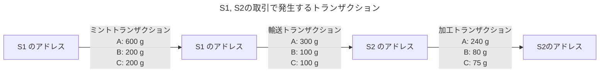
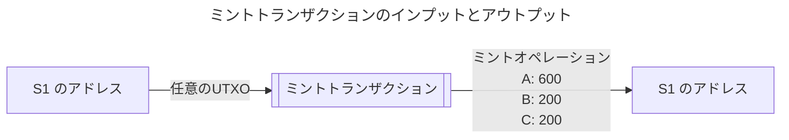
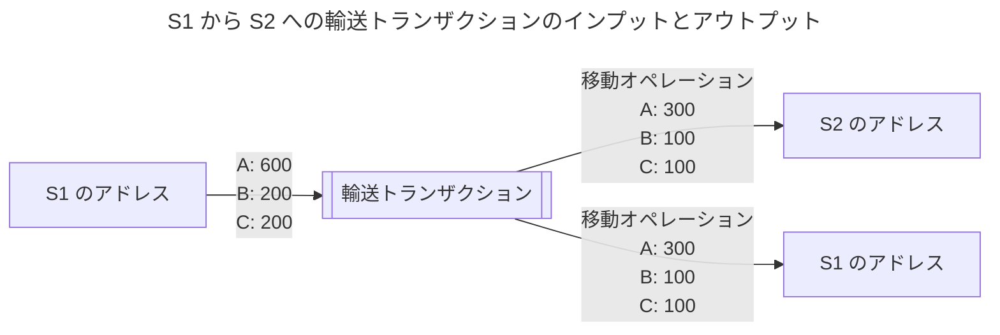
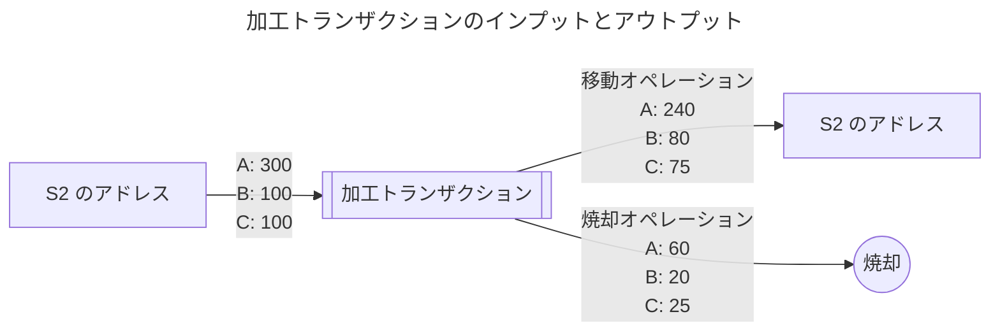
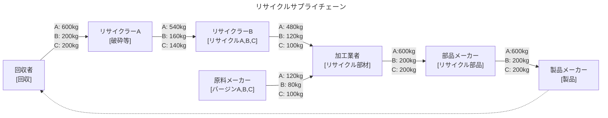
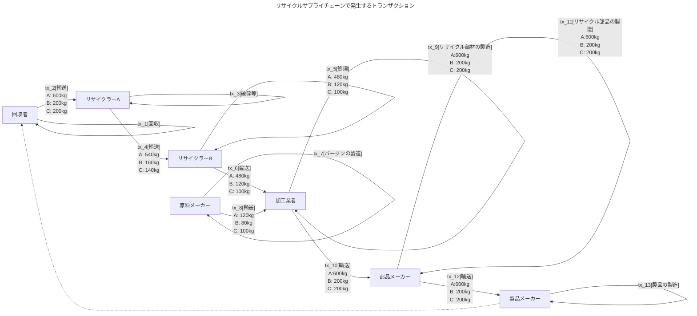
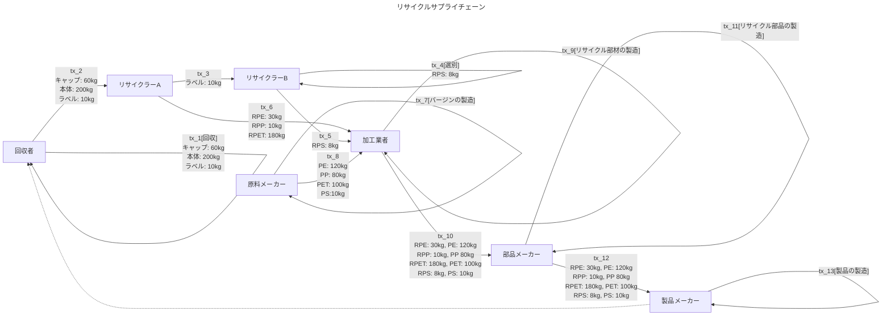



トラッキング・プロトコル v2は、製品に含まれる原材料の量を秘匿したまま、
サプライチェーンにおける原材料のトレースを可能にするためのプロトコルです。
これは例えば、原材料、メーカー、サプライヤー、リサイクル事業者を通じて移動する電池の原材料などのリサイクルの証明を担保する技術になります。

## 1. 用語

### アイテム(Item)

あるサプライチェーンで製造、分解あるいは流通するトラッキング対象のものを指します。
1つのアイテムは必ず [TPO](#tpotracking-payload-output) と [TTO](#ttotracking-transfer-output) を１つずつ持ちます。

### 材料(Material)

ある**アイテム**を構成する材料であり、各材料は**材料名**、**量**、**単位**を持ちます。
材料はアイテムを構成する化学物質やコモディティであり、アイテムの原材料のうちトラッキングを行いたいものです。

### 材料名(Material Name)

**材料**の名称を表します。材料名のダイジェストを計算することで **NUMS ポイント**（後述）を算出します。
サプライチェーン内においてユニークであることが求められます。

### 量(Quantity)

ある**アイテム**内におけるある**材料**の量を表すスカラー値です。

### 単位(Unit)

ある**材料**の**量**の単位です。サプライチェーンごとに定める必要があります。

### NUMS ポイント(NUMS Point)

**材料名**のダイジェストとして得られる楕円曲線上の点です。誰もその離散対数を知らず、
Vector Pedersen Commitment の計算では**材料**に対応した NUMS ポイントが使われます。

### Vector Pedersen Commitment

原材料を含む**アイテム** のコミットメントを計算する際に利用されるコミットメント方式です。
本方式を利用して、アイテムに含まれる原材料にコミットします。
Pedersen commitmentを拡張したこの方式では、コミットした値を公開することなく、コミットした値の加算が可能です。
その**アイテム**の**材料**の**材料名**と**量**と**単位**を開示せずに、あるサプライチェーン内での流通の各過程で
その**材料名**や**量**、**単位**が保存されていることを検証することができます。
この性質を利用して、そのサプライチェーンの参加者が不正な材料を混入させたり、材料の割合を変更するといったことが行われていないことが保証されます。

### 業務(Practice)

あるサプライチェーン内で行われる**アイテム**の製造、分解、処理、廃棄、移動といった業務を指します。
1つの業務は1つの Tapyrus トランザクションで実行され、**オペレーション**の組み合わせによって表現されます。

### オペレーション(Operation)

ある**業務**で行われる**材料**への操作です。
ある**材料**のトラッキングプロトコルへのミント(Mint)、移動(Transfer)、焼却(Burn)といったオペレーションがあります。

### ステークホルダー(Stakeholder)

あるサプライチェーンの参加者です。
そのサプライチェーンにおいてサプライヤー、製造者、ディストリビューター、卸、小売、消費者などであり、会社または個人である可能性があります。
各ステークホルダーは自身のキーペアをもち、そこから導出される**トラッキングアドレス**を使いトラッキングプロトコルへ参加します。

### トラッキングアドレス(Tracking Address)

**ステークホルダー**があるサプライチェーンにおけるトラッキングプロトコルへ参加する際に利用するブロックチェーンアドレスです。
**アイテム**はトラッキングアドレス間を移動することによってサプライチェーン内の流通の様子を記録します。
**ステークホルダー**はトラッキングアドレスを所有します。
また、１つの**ステークホルダー**が複数のトラッキングアドレスを所有し、それぞれに**アイテム**の状態を割り振ることで**アイテム**の製造工程や在庫管理など様々な状態管理を行うことも可能です。

### TPO(Tracking Payload Output)

トラッキングペイロードを scriptpubkey に `OP_RETURN < Tracking Payload >` のフォーマットで格納するアウトプットです。
TPO の次のアウトプットとして、トラッキングペイロードが含むアイテムの送り先を示すアウトプットである **TTO** がセットされます。
**オペレーション**が焼却の場合は **TTO** は省略され、**TPO** だけとなります。

### TTO(Tracking Transfer Output)

**TPO** の送り先を示すアウトプットです。
**TPO** の次のアウトプットとしてトランザクションのアウトプットベクターにセットします。
**オペレーション**が焼却の場合は **TTO** は省略されます。
scriptpubkey のフォーマットは p2pkh, p2sh 等一般的なフォーマットが使える。本仕様では特にフォーマットを制限はしていません。

## 2. トラッキングトランザクション

トラッキングトランザクションの構造は [v1](./v1spec.md#1-トラッキングトランザクション) を踏襲するため変更はありません。
v2 では　`バージョン` フィールドに `0x02` をセットすることでバージョンを識別します。
v2 では、`ペイロード` フィールドに格納するコミットメントを本ドキュメントで説明する方法で構成、利用します。

### 2.1. トラッキングペイロード

トラッキングトランザクションは、送信先のアウトプットに加えて、
輸送するモノの情報を記録するトランザクションペイロードを持つアウトプットを余分に1つ保持します。
このアウトプットが存在することで、このトランザクションがトラッキングトランザクションであることを示します。
トラッキングペイロードのアウトプットは `OP_RETURN`を使用した以下の形式になります：

```
OP_RETURN < Tracking Payload >
```

トラッキングペイロードは Table #1 のデータで構成されます：

| フィールド    | サイズ         | 内容                                    |
|----------|-------------|---------------------------------------|
| マーカー     | 2バイト        | 常に 0x5450 。トラッキングプロトコル = TP を表す Hex 値 |
| バージョン    | 1バイト        | v2 では 0x02 とする                        |
| ペイロードサイズ | CompactSize | ペイロードのサイズ                             |
| ペイロード    | 可変          | Table #2 で定義                          |

Table #1: トラッキングペイロードのデータ

| フィールド   | サイズ   | 内容                                                        |
|---------|-------|-----------------------------------------------------------|
| オペレーション | 1バイト  | Mint: 0x01, Transfer: 0x02, Burn: 0x03                    |
| コミットメント | 33バイト | **Vector Pedersen Commitment** の compressed フォーマット |

Table #2: ペイロードのデータ

### 2.2. オペレーション

トラッキングプロトコルでは**アイテム**の製造、分解、処理、廃棄などのサプライチェーン内で行われる業務を表現しながらトラッキングを行います。

それらの**アイテム**に対する複雑な業務を Tapyrus トランザクションで表現するために、
**材料**に対するオペレーションを３つ定義します。これらを組み合わせたトランザクションを作ることで様々な業務を表現する柔軟性を持ちます。

各オペレーションを以下に定義します：

* ミント(Mint)
  * 新しい**材料**をトラッキングプロトコル上に生み出します
* 移動(Transfer)
  * あるアドレスからあるアドレスへある**材料**(またはその**材料**を含む**アイテム**)を移動します
* 焼却(Burn)
  * ある**アイテム**に含まれる**材料**を焼却します（使用不能にします）

### 2.3. トレースルール

ここではトラッキングトランザクションにどのようにトレーサビリティを実現するための意味をもたせるかのルールについて説明します。

#### 2.3.1. 登録者

**オペレーション**がミントのアウトプットを持つトランザクションのインプットの内、最初のインプットを**アイテム**の登録者とします。

#### 2.3.2. 輸送元

インプットが参照する UTXO の内、トラッキングペイロードが適用される UTXO をすべて輸送元のアドレスとします。

#### 2.3.3. 輸送先

輸送先はアウトプットの内、トラッキングペイロードのアウトプットの直後にセットされている UTXO を輸送先のアドレスと規定します。
なお、1つのトラッキングトランザクションに対して、複数の輸送先を定義することを可能とします。
これはアウトプットにトラッキングペイロードが複数定義できることを意味します。各ペイロードの適用先はその直後の UTXOとします。

#### 2.3.4. 焼却

**オペレーション**が焼却かつトラッキングペイロードアウトプット(TPO)対応する送り先アウトプット(TO: Transfer Output)が存在しない場合、
そのペイロードに含まれる**アイテム**は焼却されたものとし、以降の流通が不可能になります。

### 2.4. 業務の例

トラッキングプロトコルでは、あるサプライチェーン内で行われる**アイテム**の製造、分解、処理、廃棄、移動といった過程を業務と呼びます。
1つの業務は1つの Tapyrus トランザクションで実行され、**オペレーション**の組み合わせによって表現されます。

業務には様々なものがそれぞれの業界ごとに存在していて、このドキュメントで網羅できるものではありません。
ここではよくある業務をいくつか例示し、それぞれの業務ごとにどのようなトランザクションを作成するかを示します。

#### 2.4.1 材料の追加（ミント）

トラッキングを行っている物の外から、新しく**材料**を追加する業務です。
リサイクルサプライチェーン外からバージン（リサイクルでない初めて利用される材料）を追加して利用したい場合などに行われます。
このような場合には以下のようなトラッキングトランザクションを作成します。

| インプット    | アウトプット           |
|----------|------------------|
| 任意の UTXO | TPO(オペレーション: ミント) |
|          | TTO              |

#### 2.4.2. 輸送

輸送元アドレス A から、輸送先アドレス B へある材料 a を送る業務です。また、輸送先は複数になることも考えられます。
輸送先が１つの場合は以下のようなトランザクションを作成します。

| インプット          | アウトプット                    |
|----------------|---------------------------|
| A 宛の a を含むUTXO | TPO(オペレーション: 移動, a: 10kg) |
|                | TTO(宛先: B)                |

A が所有する UTXO のトラッキングペイロードには材料 a が 10kg 含まれているものとします。
このとき、アドレス B に対しては半分の 5kg だけを送りたい。この場合には以下のようなトランザクションを作成します。


| インプット                   | アウトプット                   |
|-------------------------|--------------------------|
| A 宛の a を含むUTXO(a: 10kg) | TPO(オペレーション: 移動, a: 5kg) |
|                         | TTO(宛先: B)               |
|                         | TPO(オペレーション: 移動, a: 5kg) |
|                         | TTO(宛先: A)               |

アドレス B に加えてアドレス C 宛にも材料 a を 3kg 送りたいものとします。
この場合には以下のようなトランザクションを作成します。

| インプット                   | アウトプット                   |
|-------------------------|--------------------------|
| A 宛の a を含むUTXO(a: 10kg) | TPO(オペレーション: 移動, a: 5kg) |
|                         | TTO(宛先: B)               |
|                         | TPO(オペレーション: 移動, a: 3kg) |
|                         | TTO(宛先: C)               |
|                         | TPO(オペレーション: 移動、 a: 2kg) |
|                         | TTO(宛先: A)               |

#### 2.4.3. 製造

複数の材料を使いある製品を製造する業務です。
多くの場合複数の材料を一つのコミットメントに混ぜ合わせるトランザクションを作成することになります。
例えば、a、b、cの３つの材料を 2:1:1 の割合で混ぜ合わせ、合計 8 kg の製品を製造する場合には以下のようなトランザクションを作成します。
なお、製造者のアドレスを A とします。

| インプット              | アウトプット                                   |
|--------------------|------------------------------------------|
| A 宛の UTXO(a: 10kg) | TPO(オペレーション: 移動, a: 4kg, b: 2kg, c: 2kg) |
| A 宛の UTXO(b: 10kg) | TTO(宛先: A)                               |
| A 宛の UTXO(C: 10kg) | TPO(オペレーション: 移動, a: 6kg)                 |
|                    | TTO(宛先: A)                               |
|                    | TPO(オペレーション: 移動, b: 8kg)                 |
|                    | TTO(宛先: A)                               |
|                    | TPO(オペレーション: 移動, c: 8kg)                 |
|                    | TTO(宛先: A)                               |

#### 2.4.4. 処理

ある**アイテム**を加工や精製する業務です。
処理ことで、**アイテム**中の材料の純度が増し量が減ることがあります。
例えばペットボトルをペレットに加工する際に不純物や水分が除去され、最終的に処理されたペレットの量ははじめのアイテムの量よりも減っていることがあります。
こういった場合には焼却オペレーションを使い、以下のようなトランザクションを作成します。
なお、処理者のアドレスを A、アイテムに含まれる材料を a とします。

| インプット              | アウトプット                   |
|--------------------|--------------------------|
| A 宛の UTXO(a: 10kg) | TPO(オペレーション: 移動, a: 9kg) |
|                    | TTO(宛先: A)               |
|                    | TPO(オペレーション: 焼却, a: 1kg) |

#### 2.4.5. 選別

あるアイテムを含まれる材料ごとに選別する業務です。
リサイクルのために集められたプラスチック製品はそのそれぞれの素材が何であるかわからないままに混ざっています。
リサイクルで活用するにあたって、ポリエチレン(PE)、ポリプロピレン(PP)などのプラスチックの種類別に選別する必要があります。
選別後は各材料ごとの量がわかるため、素材の種類ごとのトラッキングが可能になります。
こういった場合には、以下のようなトランザクションを作成します。
選別者のアドレスを A 、選別前の材料を a、選別後の材料を PE, PP, PET, PS とします。

| インプット              | アウトプット                      |
|--------------------|-----------------------------|
| A 宛の UTXO(a: 10kg) | TPO(オペレーション: ミント, PE: 3kg)  |
|                    | TTO(宛先: A)                  |
|                    | TPO(オペレーション: ミント, PP: 2kg)  |
|                    | TTO(宛先: A)                  |
|                    | TPO(オペレーション: ミント, PET: 2kg) |
|                    | TTO(宛先: A)                  |
|                    | TPO(オペレーション: ミント, PS: 2kg)  |
|                    | TTO(宛先: A)                  |
|                    | TPO(オペレーション: 焼却, a: 10kg)   |

材料 a はすべて焼却オペレーションで処理され、トラッキング対象からは消えることになります。
選別されたそれぞれの材料は計量されそれぞれ記録されます。
選別されたあとの材料の量を合算しても a の量と一致することは保証されません。
実際に選別の際には不純物が取り除かれて量が減ることも珍しくありません。

## 3. トランザクションの検証ルール

すべてのトラッキングプロトコルに関わるトランザクションは、このセクションで定義されるルールによって検証された上で
ブロックチェーンネットワークへブロードキャストされなければなりません。

検証に失敗するトランザクションが発行されブロックに格納された場合、不正なトランザクションとなります。
不正なトランザクションのアウロプットを利用して作られたトランザクションも不正なトランザクションとなります。
不正なトランザクションは証明能力が無いためトラッキングプロトコルでは無効なものとして扱わなければなりません。

### 3.1. トランザクションフォーマットの検証

トラッキングトランザクションのアウトプットはトラッキングペイロードを持つアウトプット(TPO: Tracking Payload Output）と、
トラッキングペイロードに含まれる**アイテム**の送り先を示すアウトプット(TTO: Tracking Transfer Output)の２つがセットにならなければなりません。
ただし、**オペレーション**が**焼却**の場合、TTO は省略することができます。
TTO が省略された TPO の**オペレーション**は**焼却**でなくてはなりません。

TPO のペイロードに含まれるオペレーションは Table #2 で定義されている値でなければなりません。

### 3.2. バランスの検証

トランザクションは後述する例外を除きインプット、アウトプットのコミットメントを使い**材料**と**単位**と**量**のバランスが不変でなければなりません。
しかし、トランザクションが扱う**材料**と**単位**の種類と**量**は取引の秘密を守る観点から第3者へ開示することはできません。
トラッキングプロトコルではこれを実現するために **Vector Pedersen Commitment** と呼ばれる暗号スキームを利用しています。

#### 3.2.1. ミントアウトプットの除外

新たに**材料**をトラッキングプロトコルへ持ち込むためにはミントオペレーションを行うことになります。
ミントではインプットでは存在しなかった**材料**をアウトプットへ追加するため、トランザクションのインプットとアウトプットのバランスは変化してしまいます。
そのため、例外としてアウトプットのオペレーションがミントのとき、このアウトプットのコミットメントはバランスの検証から除外します。

#### 3.2.2. バランス検証のアルゴリズム

具体的なバランス検証を行うためのアルゴリズムを説明します：

1. Tx のインプットのコミットメントを収集する
     1. 検証対象のトランザクションのインプットに対応するアウトプットのうち、対応する TPO が存在するものの Tracking Payload をすべて収集します。
     2. 収集した Tracking Payload のうち、バージョンが 0x02 でないものを除外します。
2. Tx のアウトプットのコミットメントを収集する
     1. トランザクションのインプットの中から、TPO をすべて収集します。
     2. 収集した Tracking Payload のうち、バージョンが 0x02 でないものを除外します。
     3. 収集した Tracking Payload のうち、オペレーションがミントのものを除外します。
3. アウトプットのコミットメントの合算からインプットのコミットメントの合算を引き、これが無限遠点であることを検証します。

ステップ 3 が確認できた場合は、バランスがトランザクション内で不変であると検証できたことになります。

インプットから収集したコミットメントの数が $n$ 、アウトプットの数が $m$ であるとき、インプットのコミットメントを $C$ 、アウトプットのものを $C'$
とすると、この検証は以下の式で表される。

$$\sum_{k=1}^n C_k - \sum_{k=1}^m C'_k = 0$$

#### 3.2.3. 単位を変更する場合のバランスの検証

流通の過程で**材料**の単位の変更をする必要が出た場合に単位を変更することができます。
変更をするには古い単位の材料を**焼却オペレーション**を使い焼却し、新しい単位の材料を**ミントオペレーション**を使いミントする必要があります。
この場合、「3.2. バランスの検証」で説明したバランスの検証で、変換する前後の量に変化がないことを検証することはできなくなることに注意が必要です。
そのため、単位の変換が行われることをできるだけ避けるために、サプライチェーン内で扱う可能性がある最小の単位で材料を扱うことを推奨します。

## 4.コミットメントのアルゴリズム

トラッキング・プロトコル v2では、量を秘匿した状態でのトラッキングを可能にするため、Vector Pedersen Commitment をトラッキングペイロードに含めます。
ここでは Vector Pedersen Commitment の計算方法について説明する。

### 4.1. Pedersen Commitment

Pedersen CommitmentはConfidential Transactionなど暗号通貨の量を秘匿する際によく使用される暗号プリミティブです。

量をv、ブラインドファクターをrとした場合、この量は以下のPedersen Commitmentで表すことができます：

```
c = rG + vH
```

ここで、rはランダムな値、Gは楕円曲線のベースポイント、
Hはその離散対数を誰も知らないNUMS（Nothing-up-my-sleeve）ポイントである。

Confidential Transactionでは各アウトプットの量がこのPedersen Commitmentとしてエンコードされます。
以下のようなコミットメントを用いたConfidential Transactionでは、

* インプット
  * c1 = r1G + v1H
  * c2 = r2G + v2H
* アウトプット
  * c3 = r3G + v3H

インプットのコミットメントの合計からアウトプットのコミットメントの合計を差し引きます。

```
(c1 + c2) - c3 = (r1 + r2)G + (v1 + v2)H - (r3G + v3H)
```

このときインプットとアウトプットで量のバランスが不変であるなら（v1 + v2 == v3である場合）、コミットメント内のHの係数は0となり消えます。

```
(c1 + c2) - c3 = (r1 + r2 -r3)G
```

そしてブラインドファクターの総計も0とるように設定すれば、コミットメントが無限遠点を指すこととなり、
量のバランスが不変であることを証明できます。暗号通貨GrinなどのMimblewimble系のプロトコルでは、
無限遠点ではなく、(r1 + r2 -r3)Gに対して有効なSchnorr署名をインプットの所有者とアウトプットの所有者が協力して作成することで、
同様の証明を行っています（※ Hの係数が消えなければ、有効なデジタル署名は作成できないため）。

### 4.2. Vector Pedersen Commitment

Pedersen Commitmentは単一値を秘匿するのに有用ですが、
電池の**材料**（Mn：マンガンに、Ni：ニッケル、Co:コバルトなど）のように複数の**量**を秘匿する必要がある場合、
その**材料**に対応したNUMSポイントを用意することで、Pedersen CommitmentをVector Pedersen Commitmentに拡張することができます。

Mn: 300g, Ni:330g, Co:350gのような構成の場合、そのコミットメントは、

```
c = rG + 300Hm + 330Hn + 350Hc
```

となる。ここでHm、Hn、Hcはそれぞれ各**材料**に対応する**NUMSポイント**を表します。

Vector Pedersen Commitmentになっても、上記のPedersen Commitmentのようにコミットメントの加算が可能であるため、
各**材料**の**量**のバランスが不変であることは同様に検証可能です。

コミットメントに含める材料の数が $n$ 個あり、それぞれの材料の**量**を $a_i$、NUMS ポイントを $H_i$ とすると、
Vector Pedersen Commitment は以下の式で計算できます。

$$ c = rG + a_0H_0 + a_1H_1 + ... + a_{n-1}H_{n-1} =  rG + \sum_{k=0}^{n-1} a_i H_i$$

### 4.3. NUMSポイント

誰もその離散対数を知らないNUMSポイント（H = xGとなるxの値を誰も知らない）の導出には、
現在IETFで[提案中の仕様](https://datatracker.ietf.org/doc/draft-irtf-cfrg-hash-to-curve/)を利用することができます。

NUMS ポイントは**材料名**と**単位**を`|`で結合した文字列のダイジェストとして求めます。

```ruby
require 'h2c'

dst = "Tapyrus-Tracking-material-with-secp256k1_XMD:SHA-256_SSWU_RO_"
# 暗号スイートとして secp256k1_XMD:SHA-256_SSWU_RO_ を使用
h2c = H2C.get(H2C::Suite::SECP256K1_XMDSHA256_SSWU_RO_, dst)

msg = "Co|g"

p_co = h2c.digest(msg)
puts ECDSA::Format::PointOctetString.encode(p_co, compression: true).unpack('H*').first
# => 021e652c72b7665284a63532b0946bb226c5013bb3ec0ebeb5b0bc9ab4dbd2d372
```

## 5. トラッキングペイロードの作成

ここでは実際に作成するトランザクションの作成法方法をトラッキングペイロードやそこに含まれるコミットメントの計算方法も含めて説明します。

説明にあたり、あるサプライチェーンにステークホルダー S1, S2 が参加している状況を想定します。
S1、S2は直接取引があり、S1が扱う製品をS2が仕入れて加工を行います。
この取引で作成されるトランザクションは以下の図に示すようにミントトランザクション、輸送トランザクション、加工トランザクションの 3 つになる。



このセクションでは各トランザクションの実際のコミットメントの計算を示します。

### 5.1. 材料の定義

使用する材料を以下のように定めます。
NUMS ポイントは 「4.3. NUMS ポイント」で示した計算方法で算出した楕円曲線上の点を 圧縮形式でエンコードした値を記載しています。

| 材料  | 材料名 | 量の単位 | NUMS ポイント                                                          |
|-----|-----|------|--------------------------------------------------------------------|
| A   | A   | g    | 032f2cd19b4dc40ded6955804225bcab2de20edf8a6ce0e0a7a585e5e29d357250 |
| B   | B   | g    | 02c237b1d878a09340b906f28b6b478170d7e05a17c9f48618415054c7019297e9 |
| C   | C   | g    | 028a3349e438bb12a01d42fb499420ec2bae3cdb10bf6e929cf2ae5dbdad1440ac |

### 5.2. コミットメントの計算

**ミントトランザクション**

ミントトランザクションは S1 のアドレス宛の任意の UTXO をインプットにセットし、アウトプットにはミントオペレーションを使うトラッキングペイロードをセットします。



このアウトプットの計算は 「4.2. Vector Pedersen Commitment」で示した式から以下のように計算できます。

$$ c = rG + 600H_A + 200H_B + 200H_C $$

ブラインドファクター $r$ の値はランダムに選択します。
実際に計算する ruby スクリプトを以下に示します。

```ruby
require 'ecdsa'
require 'securerandom'

GROUP = ECDSA::Group::Secp256k1

# ブラインドファクターを生成
r = 1 + SecureRandom.random_number(GROUP.order - 1)

# ベースポイント G
g = ECDSA::Group::Secp256k1.generator

def decode_point(point)
  ECDSA::Format::PointOctetString
    .decode([point].pack('H*'), GROUP)
end

# 各材料の NUMS ポイントをデコードする
h_a = decode_point('032f2cd19b4dc40ded6955804225bcab2de20edf8a6ce0e0a7a585e5e29d357250')
h_b = decode_point('02c237b1d878a09340b906f28b6b478170d7e05a17c9f48618415054c7019297e9')
h_c = decode_point('028a3349e438bb12a01d42fb499420ec2bae3cdb10bf6e929cf2ae5dbdad1440ac')

# コミットメントを計算する
c = g * r + h_a * 600 + h_b * 200 + h_c * 200

puts "r: #{ECDSA::Format::IntegerOctetString.encode(r, 32).unpack('H*').first}"
# => r: f28e298ad6c018099a9bf533da648f414aec63c53d2c8d4b01208834b027c5c8

puts "c: #{ECDSA::Format::PointOctetString.encode(c, compression: true).unpack('H*').first}"
# => c: 0314aac39d7c5c1e3fb3b8c878098640b7b2146a19541e59792f6d7c87266d673a
```

ブラインドファクター $r$ の値は後で利用します。

計算したコミットメントを使い実際のトラッキングペイロードを作成し Hex 文字列にエンコードすると以下になります。

```
54500222010314aac39d7c5c1e3fb3b8c878098640b7b2146a19541e59792f6d7c87266d673a
```

各部を分解すると以下のようにトランザクションペイロードのフィールドと対応する。

| フィールド    | サイズ         | データ                                                                |
|----------|-------------|--------------------------------------------------------------------|
| マーカー     | 2バイト        | 5450                                                               |
| バージョン    | 1バイト        | 02                                                                 |
| ペイロードサイズ | CompactSize | 22                                                                 |
| オペレーション  | 1バイト        | 01                                                                 |
| コミットメント  | 33バイト       | 0314aac39d7c5c1e3fb3b8c878098640b7b2146a19541e59792f6d7c87266d673a |

以降の例ではコミットメントの値だけを示します。

**輸送トランザクション**

輸送トランザクションはミントトランザクションのアウトプット（TTO）をインプットにセットし、
アウトプットには S2 のアドレス宛の移動オペレーションのトラッキングペイロードを指定します。
S2 へは材料を半分だけ送るため、S1 の手元に残す分は別の移動オペレーションのトラッキングペイロードをアウトプットにセットします。



アウトプットが２つあるためそれぞれのためのコミットメントを計算します。
計算をする前にアウトプットのコミットメントのためのブラインドファクターを計算します。
0 番目のアウトプットのブラインドファクターを $r_0$ 、1 番めのブラインドファクターを $r_1$ とすると、
ミントトランザクションのブラインドファクター $r$ との間に以下の式が成り立つ必要があります。

$$ r = r_0 + r_1 $$

これが成り立つブラインドファクターを決定した上で、各アウトプットのためのコミットメントを計算します。
実際に計算する ruby スクリプトを以下に示します。

```ruby
require 'ecdsa'
require 'securerandom'

GROUP = ECDSA::Group::Secp256k1

# ベースポイント G
g = ECDSA::Group::Secp256k1.generator

r = 'f28e298ad6c018099a9bf533da648f414aec63c53d2c8d4b01208834b027c5c8'
r = ECDSA::Format::IntegerOctetString.decode([r].pack('H*'))

# r_0 をランダムに決定する。
r_0 = 1 + SecureRandom.random_number(GROUP.order - 1)

# r_1 を計算する
r_1 = (r - r_0) % GROUP.order

def decode_point(point)
  ECDSA::Format::PointOctetString
    .decode([point].pack('H*'), GROUP)
end

# 各材料の NUMS ポイントをデコードする
h_a = decode_point('032f2cd19b4dc40ded6955804225bcab2de20edf8a6ce0e0a7a585e5e29d357250')
h_b = decode_point('02c237b1d878a09340b906f28b6b478170d7e05a17c9f48618415054c7019297e9')
h_c = decode_point('028a3349e438bb12a01d42fb499420ec2bae3cdb10bf6e929cf2ae5dbdad1440ac')

# 0 番目のコミットメントを計算する
c_0 = g * r_0 + h_a * 300 + h_b * 100 + h_c * 100

puts "r_0: #{ECDSA::Format::IntegerOctetString.encode(r_0, 32).unpack('H*').first}"
# => r_0: ebebba3654302db48e3ff36c533ae239ea5b0d639027514a07688d9bf84dcda3

puts "c_0: #{ECDSA::Format::PointOctetString.encode(c_0, compression: true).unpack('H*').first}"
# => c_0: 03c7ba722c6efb3d8dd7810eec5680800231606a3ba42d05b859cd29a0ea34603a


# 1 番目のコミットメントを計算する
c_1 = g * r_1 + h_a * 300 + h_b * 100 + h_c * 100

puts "r_1: #{ECDSA::Format::IntegerOctetString.encode(r_1, 32).unpack('H*').first}"
# => r_1: 06a26f54828fea550c5c01c78729ad0760915661ad053c00f9b7fa98b7d9f825

puts "c_1: #{ECDSA::Format::PointOctetString.encode(c_1, compression: true).unpack('H*').first}"
# => c_1: 03eb88fc2ed8ddcdecedc50cca5769d3749b281eaeee0385d441c4ff5d6896bcb4
```

これでインプットとアウトプットのコミットメントが出揃いました。このコミットメントを使うことで、
トランザクションが扱う各材料の種類と量がわからなくても、インプットとアウトプットでバランスが不変であることを検証できます。
実際に計算する式は以下になります：

$$ C - (C_0 + C_1) = 0 $$

実際に計算する ruby スクリプトを示します。

```ruby
require 'ecdsa'

GROUP = ECDSA::Group::Secp256k1

def decode_point(point)
  ECDSA::Format::PointOctetString
    .decode([point].pack('H*'), GROUP)
end

c   = decode_point('0314aac39d7c5c1e3fb3b8c878098640b7b2146a19541e59792f6d7c87266d673a')
c_0 = decode_point('03c7ba722c6efb3d8dd7810eec5680800231606a3ba42d05b859cd29a0ea34603a')
c_1 = decode_point('03eb88fc2ed8ddcdecedc50cca5769d3749b281eaeee0385d441c4ff5d6896bcb4')

puts (c + (c_0 + c_1).negate).infinity?
# => true
```

これで計算結果が 0 (楕円曲線の無限遠点)であることが確認できました。

**加工トランザクション**

加工トランザクションでは、輸送トランザクションで S2 のアドレス宛に送られたアウトプットをインプットに使用します。
加工によってそれぞれの材料の量が減少するものとします。実際には不純物が取り除かれるなどで量が減ります。
加工により残った量は移動オペレーションにより再び S2 のアドレス宛に送られます。
減った分は焼却オペレーションのトラッキングペイロードにセットされます。焼却オペレーションでは TTO を作らずに送り先を指定しないため、これ以降流通することはありません。



加工トランザクションでのコミットメントの計算手順は上で示した輸送トランザクションと同じであるため、省略。
しかし計算の過程で問題が発生します。
S2 は 輸送トランザクションのアウトプットのコミットメントの計算に利用されたブラインドファクターを知らないため、
加工トランザクションのアウトプットのためのブラインドファクターを決定することができません。
仮にランダムな値を使用すると、コミットメントを使った検証が失敗し、トランザクションのバランスが不変であることが示せません。
そのため、ステークホルダーをまたぐトランザクションにおいては、輸送元が輸送先に対してブラインドファクターと正確な各材料の量を共有する必要があります。
この値は共有値と呼ばれ、「5.3. 共有値」で説明します。

### 5.3. 共有値

直接取引のあるステークホルダー間で輸送元から輸送先へ共有する値のために利用可能なデータを定義します。
この値を共有値(Shared Value)と呼び、以下のデータが含まれます。

* コミットメントに含まれる材料と量と単位
* ブラインドファクター $r$ の値
* コミットメントが記録されたトランザクションのアウトプットを示すアウトポイント(txid と index)

※ 共有時の通信経路は暗号化された安全な通信経路を利用する必要があります。

### 5.4. 開示値

ここではステークホルダーが自身が作成したトランザクションに含まれるコミットメントの値を開示する際のデータを定義します。
ステークホルダーは取引相手、消費者、サプライチェーンを監督する機関等へ自身が扱うアイテムに含まれる材料についてコミットメントの内容を開示することで
アイテムの品質、ルールや規格への準拠を示すことができます。

コミットメントの内容の開示のために与えられる値を **開示値(Opened Value)** と呼び、以下のデータが含まれます：

* コミットメントに含まれる材料と量と単位
* $R = rG$ の値
* アウトポイント
* ブラインドファクター r を秘密鍵として使用した署名

### 5.5. 開示値の検証

開示値の内容がブロックチェーンに記録されたコミットメントと一致するかを検証する手順を示します。

1. コミットメントと開示値の内容が一致することを確認する
2. 署名が $R$ と対応することを確認する

#### 5.5.1. 1. コミットメントと開示値の内容が一致することを確認する

ここでは開示値に含まれるアウトポイントからブロックチェーン上のコミットメントを持っているアウトプットを取得し、コミットメントを取り出します。
取り出したコミットメントと開示値に含まれる $R$ 、材料の量から計算した値が一致するかを検証します。
計算す式は「4.2. Vector Pedersen Commitment」で示したものを使用します。

#### 5.5.1. 2. 署名が $R$ と対応することを確認する

開示値に含まれる署名を $R$ を公開鍵として検証します。

## 6. シナリオ

ここではトラッキングプロトコルを利用するサプライチェーン全体に渡るシナリオを例示し、それぞれのケースにおけるトラッキングプロトコルの適用について明らかにします。

### 6.1. 一般的なリサイクルシナリオ

一般的なリサイクルサプライチェーンを想定して、リサイクルの対象となる材料の流れをトラッキングプロトコルによって
トラッキングするとどうなるかを示します。



回収者は回収場所などからリサイクル対象の材料を含んだ廃棄物を回収します。
回収された廃棄物はリサイクラーAへ渡りリサイクル可能な状態へ処理されます。
処理内容は選別、破砕、溶融等リサイクル対象の材料に応じて様々なものがあります。
処理された材料はリサイクラーBへと渡り、実際に原料として利用可能な状態に処理されます。
それがさらに加工業者へ渡るが、加工業者は材料が出荷に必要な量に足りないため、原料メーカーからバージン（まだ製品として一度も利用されていない材料）を仕入れます。
加工業者は原料から製造へ適した状態へ加工し、部品メーカーへ出荷します。
部品メーカーは材料をもとに部品を製造し供給します。
製品メーカーは部品を使い製品を組み立て、様々な商流を通じて製品を流通させます。
製品は最終的に破棄され、再び回収者によって回収されます。

### 6.2. 事前にサプライチェーンで決める項目

あるサプライチェーンにトラッキングプロトコルを提供するに当たり、事前にサプライチェーン内で合意する必要があることや、
ステークホルダー内で決めておくべきことがあります。
ここではそれらについて説明します。

#### 6.2.1. 材料の材料名と量の単位を事前に決める

トラッキングをトランザクションに登録するために、以下の項目についてリサイクルサプライチェーン全体で合意しておく必要があります。

* 各材料の材料名
* 各材料の量の単位

記録するにあたり材料名の文字列から導いた NUMS ポイントをその材料のユニークな識別子として利用することになります。
同じ材料であっても材料名にゆらぎがある場合は別の材料として扱われることになります。
量についても、記録されるトランザクション内では単なるスカラー値として扱われるため、どの単位で記録するのかを合意する必要があります。

今回のシナリオでは以下のようにする

| 材料  | 材料名 | 量の単位 |
|-----|-----|------|
| A   | A   | g    |
| B   | B   | g    |
| C   | C   | g    |

#### 6.2.2. アイテムの定義

各ステークホルダー内またはステークホルダー間で輸送されるアイテムは実際には何であるかについて決めておく必要があります。
トラッキングプロトコルがサポートするのは、アイテムに対応するコミットメント単位でのトラッキングです。
このアイテムが具体的に何を指すかは、適用対象のサプライチェーンやそれに参加するステークホルダー次第です。

そのため、アイテムがトレースを行う際の起点とする単位となります。
それより小さい単位で、後からトレースをしたいとなっても不可能なことに注意する必要があります。

例えば部品メーカーが製造する際にアイテムを同じ時間単位で製造された 10 ロット単位で扱うことにしたとします。
その後ある１つのロットの部品に重大な不良品が含まれる可能性が発覚しました。
その１つのロットの流通先をトレースしたいが、実際には10ロット単位で管理していたため、
問題のロットが流通した可能性がある範囲を特定するには一緒に管理されている10ロットすべてについて調査をする必要が出ます。

であれば、できるだけ細かい単位でアイテムを定義すればよいかというとそうではありません。
アイテムの輸送ではアイテムごとに１つのトランザクションを作成する必要があります。
複数のアイテムを１つのトランザクションで輸送すると、アイテムが混ざってしまい、輸送トランザクションの各アウトプット
それぞれが、インプットのどれと対応するかわからなくなります。
そして、トランザクションの発行には手数料の支払いが必要になります。
そのため、アイテムをどの粒度で管理したいかと、流通過程で支払う手数料のバランスを取る必要があります。


### 6.3. シナリオによって発生するトラッキングトランザクション

サプライチェーンで派生するトランザクションを以下の図の実線で示す。



各トランザクションは以下のような構造になります。
なお、手数料の支払いに必要になる TPC のインプット、アウトプットは省略しているため、実装時には適宜追加する必要があります。

#### tx_1: 回収者が回収したリサイクル品を記録するトランザクション

ミントオペレーションによって回収した材料それぞれの量を記録します。
これによりトラッキングが可能になります。

なお、ミントする材料の量はトランザクションの作成者が自由に決めることができます。
ここで量を実際よりも多くまたは少なく登録することが可能です。
サプライチェーン全体で記録と実際の流通の一致を担保するには、
ミントオペレーションを行う業務について監査を行い、監査機関による署名をトラキングペイロードに添付することが有効です。

| index | インプット      | アウトプット                                           |
|-------|------------|--------------------------------------------------|
| 0     | 回収者宛の UTXO | TPO(OP: ミント, A: 600,000, B: 200,000, C: 200,000) |
| 1     |            | TTO(宛先: 回収者)                                     |

#### tx_2: 回収者からリサイクラーAへ輸送するトランザクション

このとき、コミットメントに含まれる材料と量を開示せずとも、インプットとアウトプットでバランスが不変であることを第三者が検証できます。

| index | インプット                    | アウトプット                                          |
|-------|--------------------------|-------------------------------------------------|
| 0     | tx_1 の index が 1 のアウトプット | TPO(OP: 移動, A: 600,000, B: 200,000, C: 200,000) |
| 1     |                          | TTO(宛先: リサイクラーA)                                |

#### tx_3: リサイクラーAが破砕等の加工を行うトランザクション

この際に不純物が取り除かれ量が減ります。
減った量は焼却オペレーションによって以後流通不可能になります。
また、このとき焼却した量を含めて、インプットとアウトプットのバランスが不変であること検証可能です。

| index | インプット                    | アウトプット                                          |
|-------|--------------------------|-------------------------------------------------|
| 0     | tx_2 の index が 1 のアウトプット | TPO(OP: 移動, A: 540,000, B: 160,000, C: 140,000) |
| 1     |                          | TTO(宛先: リサイクラーA)                                |
| 2     |                          | TPO(OP: 焼却, A: 60,000, B: 40,000, C: 60,000)    |

#### tx_4: リサイクラーAからリサイクラーBへの輸送トランザクション

リサイクラーAからリサイクラーBへの輸送トランザクションです。

| index | インプット                    | アウトプット                                          |
|-------|--------------------------|-------------------------------------------------|
| 0     | tx_3 の index が 1 のアウトプット | TPO(OP: 移動, A: 540,000, B: 160,000, C: 140,000) |
| 1     |                          | TTO(宛先: リサイクラーB)                                |

#### tx_5: リサイクラーBが処理を行うトランザクション

ここでも量が減ります。
減った量は焼却オペレーションによって以後流通不可能になります。
また、このとき焼却した量を含めて、インプットとアウトプットのバランスが不変であること検証可能です。

| index | インプット                    | アウトプット                                          |
|-------|--------------------------|-------------------------------------------------|
| 0     | tx_4 の index が 1 のアウトプット | TPO(OP: 移動, A: 480,000, B: 120,000, C: 100,000) |
| 1     |                          | TTO(宛先: リサイクラーB)                                |
| 2     |                          | TPO(OP: 焼却, A: 60,000, B: 40,000, C: 40,000)    |

#### tx_6: リサイクラーBから加工業者への輸送トランザクション

リサイクラーBから加工業者への輸送トランザクションです。

| index | インプット                    | アウトプット                                          |
|-------|--------------------------|-------------------------------------------------|
| 0     | tx_5 の index が 1 のアウトプット | TPO(OP: 移動, A: 480,000, B: 120,000, C: 100,000) |
| 1     |                          | TTO(宛先: 加工業者)                                   |


#### tx_7: 原料メーカーが製造したバージン材料を記録するトランザクション

ミントオペレーションによって製造した材料それぞれの量を記録します。

| index | インプット         | アウトプット                                          |
|-------|---------------|-------------------------------------------------|
| 0     | 原料メーカー宛の UTXO | TPO(OP: ミント, A: 120,000, B: 80,000, C: 100,000) |
| 1     |               | TTO(宛先: 回収者)                                    |

#### tx_8: 原料メーカーから加工業者への輸送トランザクション

原料メーカーから加工業者への輸送トランザクションです。

| index | インプット                    | アウトプット                                         |
|-------|--------------------------|------------------------------------------------|
| 0     | tx_7 の index が 1 のアウトプット | TPO(OP: 移動, A: 120,000, B: 80,000, C: 100,000) |
| 1     |                          | TTO(宛先: 加工業者)                                  |

#### tx_9: 加工業者がリサイクル部材の製造を行うトランザクション

リサイクラーBと原料メーカーから受け取ったアウトプットをインプットにし、
アウトプットに製造した部材すべての材料の量を持つコミットメントをセットしたトランザクションを作成します。

| index | インプット                    | アウトプット                                          |
|-------|--------------------------|-------------------------------------------------|
| 0     | tx_6 の index が 1 のアウトプット | TPO(OP: 移動, A: 600,000, B: 200,000, C: 200,000) |
| 1     | tx_8 の index が 1 のアウトプット | TTO(宛先: 加工業者)                                   |

#### tx_10: 加工業者から部品メーカーへの輸送トランザクション

加工業者から部品メーカーへの輸送トランザクションです。

| index | インプット                    | アウトプット                                          |
|-------|--------------------------|-------------------------------------------------|
| 0     | tx_9 の index が 1 のアウトプット | TPO(OP: 移動, A: 600,000, B: 200,000, C: 200,000) |
| 1     |                          | TTO(宛先: 部品メーカー)                                   |

#### tx_11: 部品メーカーが部品の製造を行うトランザクション

この工程では材料の減少が発生しないため数値の変化がなく、記録としてはあまり意味がないように見えます。
実際にはインプットを一度に使用するのではなく、トラッキングしたい単位でアウトプットを分けたトランザクションをつくることになります。

| index | インプット                     | アウトプット                                          |
|-------|---------------------------|-------------------------------------------------|
| 0     | tx_10 の index が 1 のアウトプット | TPO(OP: 移動, A: 600,000, B: 200,000, C: 200,000) |
| 1     |                           | TTO(宛先: 部品メーカー)                                 |

#### tx_11': ロット単位で管理をする場合の部品メーカーが部品の製造を行うトランザクション

例えば、ロット単位で管理する場合を考えます。
１ロットあたりA: 3kg, B: 1kg, C: 1kg を消費するとします。
１日あたり10ロットが製造可能な工場であるとして、1日１つのトランザクションを作る運用であるとします。
この場合以下のようなトランザクションを作成することになります。

| index | インプット                     | アウトプット                                          |
|-------|---------------------------|-------------------------------------------------|
| 0     | tx_10 の index が 1 のアウトプット | TPO(OP: 移動, A: 3,000, B: 1,000, C: 1,000)       |
| 1     |                           | TTO(宛先: 部品メーカー)                                 |
| 2     |                           | TPO(OP: 移動, A: 3,000, B: 1,000, C: 1,000)       |
| 3     |                           | TTO(宛先: 部品メーカー)                                 |
| ...   |                           | ...                                             |
| 18    |                           | TPO(OP: 移動, A: 3,000, B: 1,000, C: 1,000)       |
| 19    |                           | TTO(宛先: 部品メーカー)                                 |
| 20    |                           | TPO(OP: 移動, A: 570,000, B: 190,000, C: 190,000) |
| 21    |                           | TTO(宛先: 部品メーカー)                                 |

index が 0 から 19 までのアウトプットは製造した部品の各ロットと対応するアウトプットとなります。
20, 21 のアウトプットは使用しなかった材料を部品メーカーのアドレスへ戻すためのアウトプットです。
次回の製造の記録をする際に、index 21 のアウトプットはインプットにセットされることになります。


#### tx_12: 部品メーカーから製品メーカーへの輸送トランザクション

部品メーカーから製品メーカーへの輸送トランザクションです。

| index | インプット                     | アウトプット                                          |
|-------|---------------------------|-------------------------------------------------|
| 0     | tx_11 の index が 1 のアウトプット | TPO(OP: 移動, A: 600,000, B: 200,000, C: 200,000) |
| 1     |                           | TTO(宛先: 製品メーカー)                                 |

#### tx_13: 製品メーカーが製品の製造を行うトランザクション

この工程では部品の製造と同じく材料の減少が発生しないため数値の変化がなく、記録としてはあまり意味がないように見えます。
tx_11' の例と同じく、ロットや製品単位など管理したい単位でアウトプットを作成し、そのアウトプットを製品と紐づけて管理することができます。

| index | インプット                     | アウトプット                                          |
|-------|---------------------------|-------------------------------------------------|
| 0     | tx_10 の index が 1 のアウトプット | TPO(OP: 移動, A: 600,000, B: 200,000, C: 200,000) |
| 1     |                           | TTO(宛先: 製品メーカー)                                 |

#### tx_13': 部品ロットを指定して製品メーカーが製品の製造を行うトランザクション

tx_11' で示した部品がロット単位で管理されている想定下で製品メーカーが製造を記録するトランザクションを示します
先にこの想定下での輸送トランザクションを示します。

輸送トランザクションの作り方には 2 パターンが考えられる。１つは、製品メーカーでは部品をロット単位で管理しないパターンです。
このパターンでは、１つのトランザクションで輸送するすべてのロットを送ることができます。
しかし、こうしてしまうと製品メーカーが製造した製品がどのロットを使用したものか確認するためにトレースバックをしても、 
１つのトランザクションで輸送したロットの内どのロットが製造に使われたか判別することができません。

もう一つのパターンは、製品メーカーでも部品をロット単位で管理する場合です。この場合は、輸送するロットごとにトランザクションを作成します。
そうした上で、製品メーカー内の製造トランザクションでも製品１つ１つについてトランザクションを作成すれば、１つの製品から部品ロットをトレースバックできるようになります。

ここでは細かいトレースバックが可能になる２つ目のパターンでトランザクションを示します。

まずは輸送トランザクションを示します。

**tx_12'_1**

| index | インプット                      | アウトプット                                    |
|-------|----------------------------|-------------------------------------------|
| 0     | tx_11' の index が 1 のアウトプット | TPO(OP: 移動, A: 3,000, B: 1,000, C: 1,000) |
| 1     |                            | TTO(宛先: 製品メーカー)                           |

**tx_12'_2**

| index | インプット                      | アウトプット                                    |
|-------|----------------------------|-------------------------------------------|
| 0     | tx_11' の index が 3 のアウトプット | TPO(OP: 移動, A: 3,000, B: 1,000, C: 1,000) |
| 1     |                            | TTO(宛先: 製品メーカー)                           |

...

**tx_12'_10**

| index | インプット                       | アウトプット                                    |
|-------|-----------------------------|-------------------------------------------|
| 0     | tx_11' の index が 19 のアウトプット | TPO(OP: 移動, A: 3,000, B: 1,000, C: 1,000) |
| 1     |                             | TTO(宛先: 製品メーカー)                           |

これをもとに製品を製造するトランザクションを示します。
１つの製品は A: 6kg, B: 2kg, C: 2kg を使用するとします。

**tx_13'**

| index | インプット                        | アウトプット                                    |
|-------|------------------------------|-------------------------------------------|
| 0     | tx_12'_1 の index が 1 のアウトプット | TPO(OP: 移動, A: 6,000, B: 2,000, C: 2,000) |
| 1     | tx_12'_2 の index が 1 のアウトプット | TTO(宛先: 製品メーカー)                           |

このようなトランザクションを製造する製品ごとに作成します。

### 6.4. マスバランス方式への対応

マスバランス方式において、計算の根拠となるリサイクル材料とバージン材料の収支が本当にあっているのかをトラッキングするために
トラッキングプロトコルを利用することができます。

マスバランス方式に対応するためには、リサイクル材料の材料名とバージン材料の材料名を変えることで、物性は同じ物質であっても
べつで量を記録し、トレースすることができます。

以下の例は回収者がペットボトルの回収(ペットボトルキャップ、ペットボトル本体、ペットボトルラベル)を行い、それをリサイクルするシナリオです。
このシナリオで利用する材料の定義を以下のように変更します。


| 材料                                     | 材料名               | 量の単位 |
|------------------------------------------|----------------------|----------|
| キャップ                                 | ペットボトルキャップ | g        |
| 本体                                     | ペットボトル本体     | g        |
| ラベル                                   | ペットボトルラベル   | g        |
| ポリエチレン                             | PE                   | g        |
| ポリプロピエン                           | PP                   | g        |
| ポリエチレン・テレフタレート             | PET                  | g        |
| ポリスチレン                             | PS                   | g        |
| リサイクル・ポリエチレン                 | RPE                  | g        |
| リサイクル・ポリプロピエン               | RPP                  | g        |
| リサイクル・ポリエチレン・テレフタレート | RPET                 | g        |
| リサイクル・ポリスチレン                 | RPS                  | g        |

これを使った場合の流通の様子を示す。



1. tx_1: 回収者が回収したリサイクル品(ペットボトルキャップ、ペットボトル本体、ペットボトルラベル)を記録する
2. tx_2: 回収者はリサイクル品(ペットボトルキャップ、ペットボトル本体、ペットボトルラベル)をリサイクラーAへ輸送する
3. tx_3: リサイクラーAはリサイクル品(ペットボトルキャップ、ペットボトル本体)から目的の材料(ポリエチレン(PE)、
      ポリプロピエン(PP)、ポリエチレン・テレフタレート(PET))へ選別し、残りの材料である(ペットボトルラベル)をリサイクラーBへ輸送する。
4. tx_4: リサイクラーBはリサイクル品(ペットボトルラベル)から材料(ポリスチレン(PS))を選別する。
5. tx_5: リサイクラーBは材料(ポリスチレン(PS))を加工業者への輸送する
6. tx_6: リサイクラーAは材料(ポリエチレン(PE)、ポリプロピエン(PP)、ポリエチレン・テレフタレート(PET))を加工業者への輸送する
7. tx_7: 原料メーカーは製造したバージン材料(ポリエチレン(PE)、ポリプロピエン(PP)、ポリエチレン・テレフタレート(PET))を記録する
8. tx_8: 原料メーカーはバージン材料を加工業者へ輸送する
9. tx_9: 加工業者はリサイクル部材を製造する
10. tx_10: 加工業者はリサイクル部材を部品メーカーへ輸送する
11. tx_11: 部品メーカーは部品の製造を行う
12. tx_12: 部品メーカーは部品を製品メーカーへ輸送する
13. tx_13: 製品メーカーは製品の製造を行う

部品メーカーはトランザクションに記録する材料の配分を調整することで、リサイクル率 100% の部品のロットと、バージン率 100% の部品のロットを製造できます。
製品メーカーへ出荷する際に、リサイクル率 100% の部品だけを出荷することで、リサイクル率 100% の製品を製造できます。

また、流通の過程でミントオペレーションを利用せずにリサイクル材料の数量を増やすことができないため、
ミントオペレーションの利用に注意を払うことで不正なくサプライチェーン内でリサイクル率 100% の製品が製造されたとみなすことができます。
ミントオペレーションの利用はトランザクションから読み取ることができるため、ミントオペレーションを行った当事者を特定し、
ミントオペレーションでミントした材料とその量、またその証拠の提示を要求することができます。
ミントが通常業務として行われることがわかっている場合は、第3者による監査を行い、監査機関による署名をミントトランザクションに添付することで、
ミント時の不正を抑制することが考えられます。

### 6.5. トレースバックを行うシナリオ

現在時点のアイテムを起点に、そのアイテムとその材料がどのように製造、流通して来たかをたどることをトレースバックと言います。
トレースバックをするシナリオを想定し、その実施の流れを示します。

以下のシナリオを想定します。

     1. ある消費者は、小売を介して製品メーカーが製造する製品を手にした。
     2. 製品には 100% リサイクルと記載されており、その横に QR コードが添付されている。
     3. 消費者はその表記が正しいことを確認したい。
     4. QR コードを読み取り、埋め込まれていた URL をブラウザで開く。
     5. URL は検証システムのドメインであり、パラメーターにその製品の**開示値**が埋め込まれている。
     6. URL からアクセスを受けた検証システムは開示値に含まれる情報をもとに、開示値を検証する。
     7. 検証システムは開示値に対応するトランザクションのすべてのトラッキングトランザクションの祖先に対して、そのバランスがインプットとアウトプットの間で不変であることを検証する。
     8. サプライチェーンでミントオペレーションに対する追加の検証ルールが指定されている場合は、全てのミントについてその検証を行う。
     9. すべての検証に成功すると、応答を作成する。応答には Valid の文字、製品に含まれる材料名と量のペアのリストなどが含まれる。
     10. いずれかの検証に失敗した場合の応答には Invalid の文字が含まれる。

このシナリオでは消費者へ製品の品質を保証するためにトレースデータを利用しています。
ここでは３段階の検証を行っています。

* 検証1. 開示値とブロックチェーンに記録されたコミットメントが一致することの検証
* 検証2. 材料の量と種類が流通過程でバランスを保っているかの検証
* 検証3. ミントされた量が認証を受けているかの追加の検証

検証1, 2 については、このトラッキングプロトコルに沿ってトランザクションを作成していれば検証可能な項目になります。
検証3 については、トラッキングプロトコルの範囲外となります。
検証3 はサプライチェーン内で追加された検証ルールです。
追加されたルールに沿って追加の検証を行うことができるようになっています。

このシナリオでは消費者は検証システムの表示を信頼するしかないが、ブロックチェーンがもつトランザクション情報は公開情報であるため、
消費者自身がブロクチェーンネットワークへ直接参加し検証1,2 を行うことができます。
また、開示値さえ URL から抜き出せば、サードバーティー製のアプリケーションを使い検証を行うこともできます。

### 6.6. トレースフォワードを行うシナリオ

次のシナリオは製品ごとに製造トランザクションが作られた tx_13' のケースをベースに考えます。

     1. ある小売は入荷した tx_13' で製造された製品の検品を行った際に不良を発見する。
     2. 小売は製品メーカーへ不良を報告しメーカーへ返品した。
     3. メーカーは返品された製品を調査し、使用した部品に不良があることを確認し部品メーカーへ問い合わせる。
     4. 部品メーカーで原因を調査する。問題部品が製造された日だけ生産ラインの設定に不備があり、不良部品と同日に製造された他の部品にも不良があることがわかった。
     5. 製品メーカーは部品メーカーから問題がある部品の輸送トランザクションのTTO、TPOのリストを入手した。
     6. このリストをもとに、リストに含まれる部品が使用された製品のリストを作成した。
     7. 特定した製品の出荷先に対して、不良の可能性があるため回収することを連絡した。

このシナリオではトレースバックとトレースフォワードが何度か利用されています。

はじめにトラッキングプロトコルが利用されるのは 3 の部品メーカーへの問い合わせです。
製品の製造トランザクションから使用された部品がどのロットのものであるかを特定できます(トレースバック)。
そのロットが部品メーカーから製品メーカーへの輸送トランザクションのうち、どの TPO に一致するかを特定し、
そのアウトポイント（txid, index)を部品メーカーへ伝えることで部品メーカー側でも問題があったロットを識別できます。

４で部品メーカーは同日に製造された部品ロットを特定するために、製造トランザクションのうち取り込まれたブロックのタイムスタンプが該当日であるものをリストアップします。
これから不良品を含む可能性がある製品ロットの製品メーカーへの輸送トランザクションの TPO 及び TTO をリストアップできます(トレースフォワード)。

6では製品メーカーは5で入手したリストの TTO をインプットとして使用した製造トランザクションを特定し、
更に出荷先への輸送トランザクションまでたどることで、不良の可能性がある製品を出荷した相手をリストアップできます(トレースフォワード)。

なお、出荷先から更に小売や消費者のもとへ製品が移動していたとしても、直接取引がない相手の場合はトラッキングアドレスと、
名称や住所などの情報が結びつかないため部品メーカーが直接特定することはできません。
仮にサプライチェーン内では各ステークホルダーのアドレスを全体に公開するというルールがあれば特定し、直接製品メーカーから問い合わせることも可能になります。
ただし、製品がサプライチェーン外へ移動していた場合はブロックチェーンには痕跡が残らないためやはり特定はできません。

## 7. 今後の拡張可能性

本セクションで示す暗号スキームの導入によってトラッキングプロトコルを強化できる可能性があります。
今後の可能性として示します。

### 7.1. 多項式コミットメントスキーム

本プロトコルでは、楕円曲線を利用したVector Pedersen Commitmentを使用するが、準同型性のあるコミットメントスキームであれば
基本的に切り替えが可能です。例えば、多項式コミットメントスキームの一種である
[KZG Commitment](https://www.iacr.org/archive/asiacrypt2010/6477178/6477178.pdf)などでも可能だと思われます。

### 7.2. 範囲証明

上記の量のバランスの検証において、各コミットメント内の量がオーバーフローしていない（マイナスの値になっていない）ことを証明する必要があります。

Pedersen Commitmentの値の範囲証明は、Borromeanリング署名や最近ではBulletproofsなどが有用です。
Vector Pedersen Commitmentのように、値のベクトルに対して範囲証明を行う場合、以下のようなプロトコルになります。

コミットメントを

$$ c = rG + a_0H_0 + a_1H_1 + ... + a_{n-1}H_{n-1} $$

とし、各 $a_i$ が $2^s$ の範囲内であることを証明したい場合、
一様にランダムなブラインドファクター $b_{i, j}$ （ここで $0 \leq i < n$ かつ $0 \leq j < s$ ）を使用して $(n\cdot s)$ のコミットメントを作成し宣言します。
各コミットメント $C_{i,j}$ は $C_{i,j} = (z_{i, j}\cdot 2^j)G_i + b_{i,j}H$ として計算されます。
ここで $z_{i,j}$ は0か1で、コンポーネント $a_i$ のj番目のビットを表します。

検証者は、 $C' = \sum C_{i,j}$ を計算できます。
CがC'と同じコンポーネント $a_i$ のリストを表していることは、ベースポイントH上の公開鍵（C - C'）に対する署名を提供することで証明できます。
点（C - C'）の秘密鍵は、 $b - \sum b_{i,j}$ です。

これで２つのことが証明されました。

* CはC'と同じ構成コンポーネントのリストに対するコミットメントであること。
* そして各コンポーネント $a_i$ はs bit以下のリストとして構成されること。

したがって正の数でなければならない。

あとは、宣言されたコミットメント $C_{i,j}$ のそれぞれが実際には0か $2^jG_i$ へのコミットメントであることを証明するだけです。

これは、ベースポイントG上の $C_{i,j}$ か $(C_{i,j} - 2^jG_i)$ のいずれかの秘密鍵が知られていることを証明する任意の種類のリング署名を用いて達成することができます。
これを実現するには、Bulletproofsやより理解しやすいBorromeanリング署名を使用することができます。

